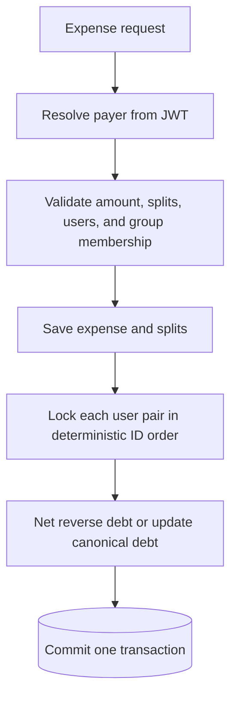

# Splitwise API

[](https://github.com/Shubhank2604/Splitwise/actions/workflows/ci.yml)

A transactional expense-sharing API that keeps authentication, monetary arithmetic, concurrent ledger updates, settlements, and retry behavior correct under real failure modes.

## Engineering guarantees

| Failure mode | Design response | Repository evidence |
|---|---|---|
| A client impersonates another payer or group owner | Protected operations derive the actor from the JWT subject; request bodies do not select the authenticated identity | Authentication, ownership, and group-authorization integration tests |
| Decimal or split errors corrupt balances | Money uses `BigDecimal` / `DECIMAL(19,2)`; positive, unique splits must equal the expense total exactly | Expense-invariant and rollback tests |
| Concurrent writes create opposing or duplicate debt rows | User pairs are locked in deterministic ID order and debt is stored in one canonical direction | Debt-netting and concurrent first-write tests |
| A timed-out client retries a committed write | Actor-scoped `Idempotency-Key` values and semantic request fingerprints return exact replays while changed payloads receive `409 Conflict` | Expense and settlement replay integration tests plus database uniqueness constraints |
| A settlement exceeds the outstanding balance | Settlement and ledger mutation share one transaction; nonexistent debt and overpayment are rejected | Partial, full, and overpayment settlement tests |
| Application entities drift from the database | Flyway owns schema evolution and Hibernate validates it at startup | Migrations exercised by the full CI test suite |

## Core invariants

- The authenticated principal—not a client-supplied user ID—owns each protected action.
- Every financial mutation either commits its records and canonical ledger updates together or rolls back completely.
- Opposing debts are netted into one direction, so balances do not depend on reconstructing contradictory rows.
- Expense and settlement retries cannot alter the ledger twice.
- Only group creators can add members, and every participant in a group expense must belong to that group.

## Expense transaction



For each non-payer split, the participant becomes the debtor and the authenticated payer becomes the creditor. Expense rows, split rows, and every resulting ledger update share one transaction; a validation or ledger failure rolls back the whole request.

Deterministic user-pair locking serializes both updates to an existing balance and the first balance created for a pair. This prevents two concurrent requests from creating contradictory debt rows.

## Canonical debt example

Suppose Alice pays a `$100.00` dinner split as `$20.00` for Alice and `$80.00` for Bob:

```text
Bob -> Alice: $80.00
```

Bob later pays a `$50.00` expense entirely for Alice. That produces debt in the opposite direction, so the service nets it against the existing row:

```text
Before: Bob -> Alice: $80.00
Apply:  Alice -> Bob: $50.00
After:  Bob -> Alice: $30.00
```

The database stores only the final `$30.00` direction. It does not keep two opposing rows whose net value must be reconstructed later.

## Settlement example

Bob settles `$12.50` with Alice:

```bash
curl -X POST http://localhost:8080/api/settlements \
  -H 'Authorization: Bearer BOBS_TOKEN' \
  -H 'Idempotency-Key: settlement-bob-alice-001' \
  -H 'Content-Type: application/json' \
  -d '{"receiverId":1,"groupId":null,"amount":12.50}'
```

The server derives Bob from the token, locks the Alice/Bob pair, verifies that Bob owes Alice at least `$12.50`, reduces the debt to `$17.50`, and records the settlement in the same transaction. An amount above `$30.00` is rejected; a full `$30.00` settlement deletes the debt row.

## Stack

Java 17, Spring Boot, Spring Security, Spring Data JPA, MySQL 8, Flyway, JJWT, JUnit 5, AssertJ, H2, Docker Compose, and GitHub Actions.

## Run locally

Requirements: Java 17+, Maven 3.9+, and Docker.

```bash
docker compose up -d
export JWT_SECRET="replace-this-with-at-least-32-random-characters"
mvn spring-boot:run
```

The default local database values match `compose.yml`. For a different database, set `DB_URL`, `DB_USERNAME`, and `DB_PASSWORD`; see `.env.example`.

Health check:

```bash
curl http://localhost:8080/actuator/health
```

## API walkthrough

Register and log in:

```bash
curl -X POST http://localhost:8080/api/auth/register \
  -H 'Content-Type: application/json' \
  -d '{"username":"alice","email":"alice@example.com","password":"strong-password"}'

curl -X POST http://localhost:8080/api/auth/login \
  -H 'Content-Type: application/json' \
  -d '{"username":"alice","password":"strong-password"}'
```

Use the returned token on protected requests:

```bash
curl -X POST http://localhost:8080/api/expenses \
  -H 'Authorization: Bearer YOUR_TOKEN' \
  -H 'Idempotency-Key: expense-dinner-001' \
  -H 'Content-Type: application/json' \
  -d '{
    "description": "Dinner",
    "amount": 100.00,
    "groupId": null,
    "splits": [
      {"userId": 1, "amount": 20.00},
      {"userId": 2, "amount": 80.00}
    ]
  }'
```

The authenticated user is the payer. There is deliberately no `paidByUserId` field.

`Idempotency-Key` values are scoped to the authenticated actor. Reusing a key with the same semantic request returns the existing expense or settlement; reusing it with a different amount, participants, group, receiver, or description returns `409 Conflict`. Database uniqueness also prevents two records from claiming the same actor/key pair.

| Method | Endpoint | Purpose |
|---|---|---|
| `POST` | `/api/auth/register` | Create an account |
| `POST` | `/api/auth/login` | Obtain a JWT |
| `GET` | `/api/users/me` | Read the authenticated profile |
| `GET` | `/api/users/me/balance` | Read the authenticated user's ledger |
| `POST` | `/api/groups` | Create a group as the authenticated user |
| `POST` | `/api/groups/{id}/members` | Add members as the group creator |
| `POST` | `/api/expenses` | Record and split an expense |
| `POST` | `/api/settlements` | Settle the authenticated user's debt |
| `GET` | `/api/dashboard` | Read personal and per-group net balances |

Positive balances mean another user owes you; negative balances mean you owe them.

## Verification

```bash
mvn verify
```

The test suite covers authentication boundaries, password-hash response safety, expense invariants, group authorization, opposing-debt netting, settlement overpayment, full settlement, and JWT configuration. CI runs the same command for every pull request and every push to `master`.

## Security notes

- Supply `JWT_SECRET` from a secret manager in production; startup rejects secrets shorter than 32 bytes.
- JWT failures return `401` rather than leaking parser errors or becoming server errors.
- Passwords are BCrypt hashes and are never included in response DTOs.
- All protected operations use the authenticated principal as their ownership boundary.
- This project is an educational implementation, not a custodian of real funds.

## License

Released under the [MIT License](LICENSE).
